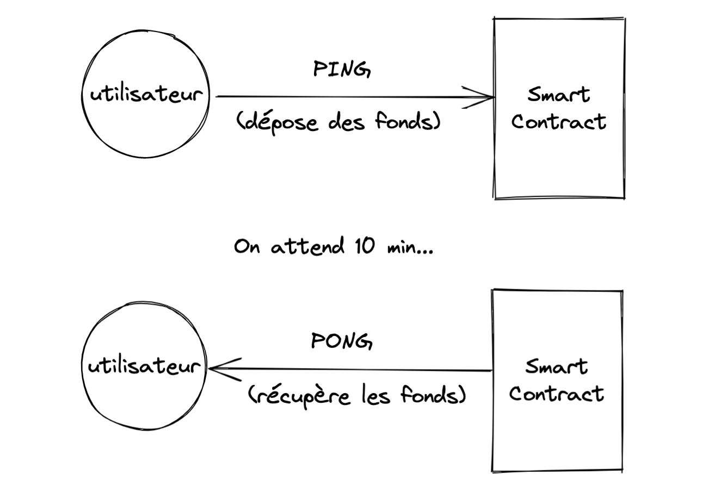

# Comment créer sa première Dapp en 15 min

Apprenez à construire votre première application décentralisée (Dapp pour Decentralized Application en anglais) sur la blockchain Elrond !

> ⚠️ Veuillez créer un exemple de portefeuille sur Elrond [(ici)](https://devnet-wallet.elrond.com/) et ayez votre phrase de sécurité à portée de main (les 24 mots que l'on vous donne à la création de votre portefeuille). Nous allons travailler sur le Devnet pour cet exemple, vous devez gérer votre portefeuille Web [ici](https://devnet-wallet.elrond.com/).

Ce tutoriel est aussi disponible en vidéo (en anglais) [ici](https://youtu.be/IdkgvlK3rb8)

## Description de la Dapp (Ping-Pong)

[](tuto-fr/first-dapp-in-15-min/img/sc_overview.png)

L'application Ping-Pong est une **application décentralisée** très simple qui permettra à l'utilisateur de déposer un nombre spécifique de jetons (la valeur par défaut est 1 xEGLD) à une adresse de contrat intelligent (**smart contract**) et de les verrouiller pendant une durée spécifique (la valeur par défaut est de 10 minutes) . Une fois cet intervalle de temps écoulé, l'utilisateur peut réclamer le même nombre de jetons. L'envoi de fonds au contrat est appelé **PING**, réclamer le même montant s'appelle **PONG**.

> Ici, j'utiliserai tout le temps le terme de **smart contract** pour parler d'un contrat codé sur la blockchain car c'est tout simplement un terme à connaître si vous voulez devenir développeur dans le monde de la blockchain.

Règles additionnelles de notre smart contract

- L'utilisateur ne peut utiliser PING qu'**une seule fois** avant PONG (pas de PING multiples).
- L'utilisateur doit récupérer **l'entièreté des fonds** qui ont été PING, pas plus, pas moins.

Vous avez peut-être remarqué que le montant par défaut pour un dépôt est 1 xEGLD et non 1 EGLD qui est le jeton officiel d'Elrond, c'est parce que, à des fins de test, nous utilisons Elrond Devnet, qui est un environnement de test identique au Mainnet, la Blockchain officielle d'Elrond. Ici, la devise est xEGLD, c'est juste un jeton de test, ça ne vaut rien.

> 🌟 Quand vous créez un portefeuille sur Elrond, vous avez en réalité accès aux trois environnements (ou blockchains) d'Elrond Network. L'environnement **Devnet** est l'environnement de développement pour les jeunes projets, le token est le xEGLD qui ne vaut absolument rien. C'est sur ce réseau que nous allons construire notre Dapp. Il existe également l'environnement **Testnet** qui est la blockchain de test, on y retrouve les smarts contracts de différents projets en phase avancée de développement, le token est également le xEGLD. Le dernier environnement est le **Mainnet,** la blockchain principale car celle avec le token EGLD, on y retrouve tous les projets qui se sont lancés sur la blockchain Elrond. **Vos 24 mots prodigués à la création de votre portefeuille sont donc très utiles mais également très importants**, ils sont le gage d'accès à votre portefeuille sur ces 3 blockchains.

> 🚨 **Si vous développez sur Elrond Devnet ou Testnet, utilisez donc un autre portefeuille que celui dont vous vous servez sur le Mainnet, il faudra en effet manipuler votre clé privée (créée à partir des 24 mots) pour certaines opérations. Si vous travaillez avec git, je vous conseille de ne pas prendre de risques si vous êtes débutant et d'utiliser un autre portefeuille.**

## L'architecture de notre Dapp


### La couche d'application (le Frontend)

Pour l'application web, on aura deux pages:

- La _page de connexion_ - nous pouvons nous authentifier avec une ledger, un portefeuille Web Elrond ou avec Maiar Wallet sur téléphone
- La page _Tableau de bord_ - nous pouvons soit déclencher les fonctions ping ou pong du smart contract (à l'aide de boutons à cliquer par exemple), si nous avons déjà déposé, alors nous verrons un compte à rebours jusqu'à ce que l'intervalle de temps ne s'efface.

### La couche blockchain (le Backend)

Nous allons créer un smart contract qui peut gérer le dépôt (**`ping`**), la réclamation (**`pong`**) et les actions de statut (**`did_user_ping`**, **`get_time_to_pong`**). Disons que, pour l'instant, ce smart contract joue le rôle d'une API (Application Programming Interface) dans une dApp. C'est aussi à cette couche que réside toute la logique de notre application décentralisée.

Elrond Devnet est un réseau de test public maintenu par notre communauté où tout développeur peut tester ses smart contracts et ses dApps dans un environnement réel.

> 🌟 La fonction **did_user_ping** nous certifiera si oui ou non un utilisateur a déjà appelé la fonction **ping** de notre smart contract, la fonction **get_time_to_pong** nous renverra le temps restant avant de pouvoir appeler la fonction pong. Ces deux fonctions sont appelées des **\*views\*** (des fonctions de consultation) dans la documentation d'Elrond. Ce sont des fonctions à titre informatif seulement, elles ne changent aucune variable sur la blockchain. Nous garderons la dénomination de **\*views\*** car elle sera présente dans le code.

## Préparer l'environnement de développement

### Structure du projet

Configurer l'environnement

Créons d'abord un nouveau dossier pour notre projet, je le nommerai **ping-pong**.

```bash
mkdir -p ping-pong/wallet
cd ping-pong/wallet
```

Au final, nous aurons trois sous-dossiers : **\*wallet\***, **\*contract\*** et **\*dapp\***. Pour plus de commodité, nous enregistrerons la clé du portefeuille de notre propriétaire dans le dossier **\*wallet** (portefeuille en anglais)\*.


### Prérequis logiciels

Prérequis logiciels

Dans notre exemple, nous utiliserons **Ubuntu 20.04**. MacOs fonctionne également (passez au dernier paragraphe de cette section). Nous devrons installer **`python 3.8`**, **`python-pip`** et **`libncurses5`**. Pour le frontend, nous utiliserons un modèle d'application basé sur **React JS**, nous aurons donc besoin de **`nodejs`** et de **`npm`**.

Tout d'abord, nous nous assurons que les prérequis du système d'exploitation sont installés :

```bash
sudo apt-get update
sudo apt install libncurses5 python3-pip nodejs npm
```

Nous aurons également besoin d'`erdpy`, l'outil de ligne de commande Elrond, qui est utile pour signer des transactions, déployer des smart contracts, gérer des portefeuilles, des comptes et des validateurs. Nous l'utiliserons pour déployer notre smart contract sur la blockchain. **Erdpy** peut être installé à l'aide de la page de documentation Elrond suivante: https://docs.elrond.com/sdk-and-tools/erdpy/installing-erdpy

Nous allons télécharger le programme d'installation `erdpy` et nous l'exécutons:

```bash
wget -O erdpy-up.py <https://raw.githubusercontent.com/ElrondNetwork/elrond-sdk-erdpy/master/erdpy-up.py>
python3 erdpy-up.py
```

Redémarrez la session utilisateur pour activer erdpy

```bash
source ~/.profile
```

Afin d'installer `erdpy` sur MacOs, vous devez vous assurer que vous avez installé `python 3.8` et `pip` sur votre système. Ensuite, installez la dernière version d'`erdpy` en utilisant `pip`.

```bash
pip3 install --user --upgrade --no-cache-dir erdpy
```

Si vous rencontrez une erreur relative au paquet `pynacl`, assurez-vous que `libsodium` est installé.

```bash
brew install libsodium
```

### Créer un portefeuille propriétaire

Nous avons maintenant tous les prérequis installés, créons un **fichier PEM de portefeuille propriétaire**.

Le smart contract ne peut être déployé sur la blockchain que par un propriétaire, nous allons donc créer un portefeuille propriétaire [**ici**](https://devnet-wallet.elrond.com/). Le propriétaire peut également mettre à jour le contrat, plus tard, si nécessaire.

Passons au portefeuille Elrond, cliquez sur "**Créer un nouveau portefeuille**", notez la phrase de sécurité (24 mots) qui peut nous aider à récupérer le portefeuille, et le mot de passe pour le fichier JSON qui stock notre clé (que nous enregistrerons dans le dossier `~/ping-pong/wallet`). Nous devrions pouvoir voir notre nouvelle adresse de propriétaire de portefeuille Elrond qui est, dans ce cas, _erd1......._

Nous pouvons également générer un fichier PEM de clé privée, ainsi nous n'aurons pas besoin d'entrer le mot de passe de notre portefeuille à chaque fois que nous voudrons confirmer une transaction.

```bash
cd ~/ping-pong/wallet
erdpy --verbose wallet derive ./wallet-owner.pem --mnemonic
```

Entrez vos **24 mots secrets** lorsque vous y serez invité et un nouveau fichier PEM sera créé. Cette commande nécessite que vous saisissiez les 24 mots séparés chacun par un espace.

Afin d'initier des transactions sur la blockchain, nous avons besoin de fonds, chaque transaction coûte très peu de frais, sur la blockchain, cela s'appelle du **gaz**. Sur le portefeuille **Devnet**, nous avons un onglet **Faucet** qui vous permet d'obtenir des fonds de test gratuits pour nos applications. Nous pouvons demander 10 xEGLD toutes les 24 heures, alors demandons 10 xEGLD maintenant. Nous vérifions maintenant si la transaction a réussi, et oui, nous voyons que nous avons maintenant 10 xEGLD dans notre portefeuille Devnet.

## La couche blockchain - Le smart contract
